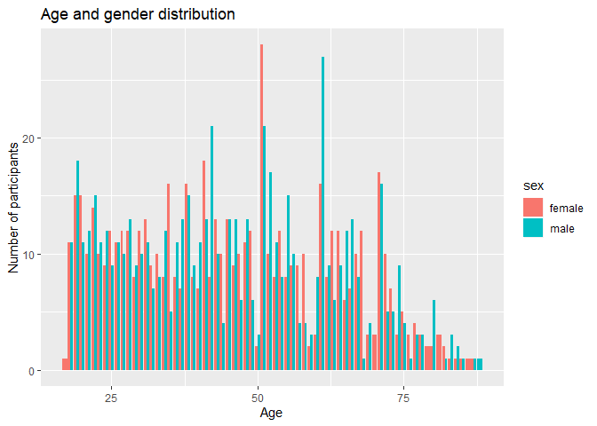
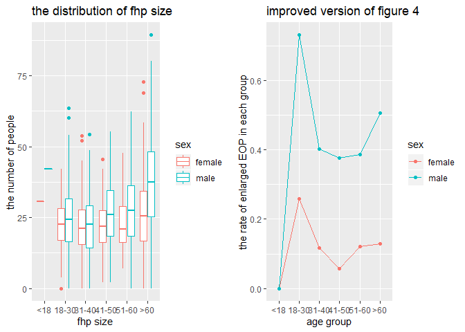
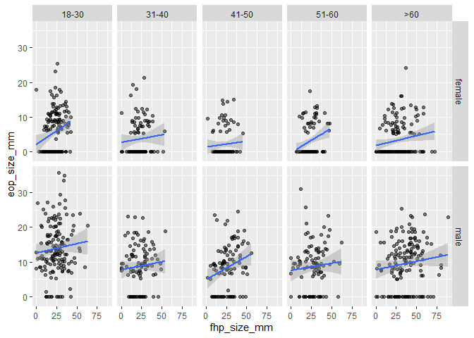

p8105\_mtp\_yj2580
================
yj2580
10/20/2019

## Problem 1 - DATA

``` r
data = 
  # load the data and skip first 8 extra rows
  read_excel("./data/p8105_mtp_data.xlsx", skip = 8) %>%
  # clean variables' names
  janitor::clean_names() %>%
  mutate(
  # fill in missing values with 0 for EOP size
    eop_size_mm = ifelse(is.na(eop_size_mm) == TRUE, "0", eop_size_mm),
    fhp_size_mm = ifelse(is.na(fhp_size_mm) == TRUE, "0", fhp_size_mm),
    eop_size_mm = as.numeric(eop_size_mm),
    fhp_size_mm = as.numeric(fhp_size_mm),
    sex = recode(sex, "0" = "female", "1" = "male"),
    age_group = recode(age_group, 
                       "1" = "<18", 
                       "2" = "18-30", 
                       "3" = "31-40", 
                       "4" = "41-50", 
                       "5" = "51-60", 
                       "6" = ">60", "7" = ">60", "8" = ">60"),
    # create ordered factors for categorical variables below
    sex = factor(sex, levels = c("female", "male")),
    age_group = factor(age_group, levels = c("<18", "18-30", "31-40", "41-50","51-60", ">60")),
    eop_size = factor(eop_size, levels =  c("0", "1", "2", "3", "4","5", "14.6")),
    eop_visibility_classification = factor(eop_visibility_classification, levels = c("0", "1", "2")),
    fhp_category = factor(fhp_category, levels = c("0", "1", "2", "3", "4", "5", "6", "7", "30.8"))
  )
```

Show age and gender distribution by tables

``` r
data %>% 
  group_by(sex) %>%
  summarise(number_of_participants = n()) %>%
  knitr::kable()
```

| sex    | number\_of\_participants |
| :----- | -----------------------: |
| female |                      614 |
| male   |                      607 |

``` r
data %>%
  group_by(age) %>%
  summarise(number_of_participants = n()) %>%
  knitr::kable()
```

| age | number\_of\_participants |
| --: | -----------------------: |
|  17 |                        1 |
|  18 |                       22 |
|  19 |                       33 |
|  20 |                       26 |
|  21 |                       22 |
|  22 |                       29 |
|  23 |                       21 |
|  24 |                       21 |
|  25 |                       21 |
|  26 |                       22 |
|  27 |                       22 |
|  28 |                       25 |
|  29 |                       17 |
|  30 |                       22 |
|  31 |                       24 |
|  32 |                       16 |
|  33 |                       18 |
|  34 |                       20 |
|  35 |                       21 |
|  36 |                       19 |
|  37 |                       20 |
|  38 |                       31 |
|  39 |                       17 |
|  40 |                       18 |
|  41 |                       31 |
|  42 |                       29 |
|  43 |                       23 |
|  44 |                       14 |
|  45 |                       26 |
|  46 |                       22 |
|  47 |                       16 |
|  48 |                       24 |
|  49 |                       18 |
|  50 |                        5 |
|  51 |                       49 |
|  52 |                       27 |
|  53 |                       19 |
|  54 |                       20 |
|  55 |                       23 |
|  56 |                       19 |
|  57 |                       13 |
|  58 |                       14 |
|  59 |                        5 |
|  60 |                       11 |
|  61 |                       43 |
|  62 |                       17 |
|  63 |                       18 |
|  64 |                       21 |
|  65 |                       18 |
|  66 |                       20 |
|  67 |                       18 |
|  68 |                       13 |
|  69 |                        7 |
|  70 |                        3 |
|  71 |                       33 |
|  72 |                       15 |
|  73 |                       12 |
|  74 |                       12 |
|  75 |                        9 |
|  76 |                        4 |
|  77 |                        7 |
|  78 |                        6 |
|  79 |                        2 |
|  80 |                        8 |
|  81 |                        3 |
|  82 |                        3 |
|  83 |                        4 |
|  84 |                        3 |
|  85 |                        2 |
|  86 |                        1 |
|  87 |                        2 |
|  88 |                        1 |

``` r
data %>%
  group_by(age, sex) %>%
  summarise(number_of_participants = n()) %>%
  ggplot(aes(x=age, y=number_of_participants, fill = sex)) + geom_bar(stat = "identity", position = "dodge")
```

<!-- -->

Note issues in the available data

``` r
data %>%
  janitor::clean_names() %>%
  mutate(
    age_correct = ifelse(age < 18, "<18",
                    ifelse(age <= 30, "18-30",
                      ifelse(age <= 40, "31-40",
                        ifelse(age <= 50, "41-50",  
                          ifelse(age <= 60, "51-60", ">60"))))),
    age_logical = ifelse(age_group == age_correct, "1", "0")
  ) %>%
  filter(age_logical == "0") %>%
  select(age, age_group, age_correct) %>%
  knitr::kable()
```

| age | age\_group | age\_correct |
| --: | :--------- | :----------- |
|  45 | \<18       | 41-50        |

``` r
data %>%
  janitor::clean_names() %>%
  mutate(
    eop_size_mm = as.numeric(eop_size_mm),
    # correct misclassifications
    eop_size_correct = 
      ifelse(eop_size_mm<5, "0", 
          ifelse(eop_size_mm<10, "1",
              ifelse(eop_size_mm<15, "2", 
                  ifelse(eop_size_mm<20, "3", 
                        ifelse(eop_size_mm<25, "4", "5"))))),
    eop_size_logical = ifelse(eop_size == eop_size_correct, "1", "0")
  ) %>%
  filter(eop_size_logical == "0") %>%
  select(eop_size_mm, eop_size, eop_size_correct) %>%
  knitr::kable() 
```

| eop\_size\_mm | eop\_size | eop\_size\_correct |
| ------------: | :-------- | :----------------- |
|         33.50 | 4         | 5                  |
|         25.50 | 4         | 5                  |
|         35.00 | 4         | 5                  |
|         29.50 | 4         | 5                  |
|          2.11 | 4         | 0                  |
|         20.00 | 3         | 4                  |
|         31.10 | 4         | 5                  |
|          5.00 | 0         | 1                  |
|         35.70 | 4         | 5                  |
|         20.00 | 3         | 4                  |
|         25.40 | 4         | 5                  |
|         26.80 | 4         | 5                  |
|         23.50 | 5         | 4                  |
|         22.90 | 5         | 4                  |
|          0.00 | 1         | 0                  |
|         15.00 | 14.6      | 3                  |
|         14.60 | 3         | 2                  |
|         12.10 | 3         | 2                  |

``` r
data %>%
  janitor::clean_names() %>%
  mutate(
   eop_visibility_correct = 
      ifelse(eop_size_mm == 0, "0", 
             ifelse(eop_size_mm <= 5, "1", "2")),
   eop_visibility_logical = ifelse(eop_visibility_classification == eop_visibility_correct, "1", "0")
  ) %>%
  filter(eop_visibility_logical == "0") %>%
  select(eop_size_mm, eop_visibility_classification, eop_visibility_correct) %>%
  knitr::kable()
```

| eop\_size\_mm | eop\_visibility\_classification | eop\_visibility\_correct |
| ------------: | :------------------------------ | :----------------------- |
|          0.00 | 1                               | 0                        |
|          0.00 | 1                               | 0                        |
|          0.00 | 1                               | 0                        |
|          0.00 | 1                               | 0                        |
|          1.40 | 2                               | 1                        |
|          0.00 | 1                               | 0                        |
|          0.00 | 1                               | 0                        |
|          0.00 | 1                               | 0                        |
|          0.00 | 1                               | 0                        |
|          0.00 | 2                               | 0                        |
|          0.00 | 1                               | 0                        |
|          0.00 | 1                               | 0                        |
|         23.10 | 1                               | 2                        |
|         17.40 | 1                               | 2                        |
|          0.00 | 1                               | 0                        |
|          2.11 | 2                               | 1                        |
|          0.00 | 1                               | 0                        |
|          0.00 | 1                               | 0                        |
|          0.00 | 1                               | 0                        |
|          0.00 | 1                               | 0                        |
|          0.00 | 1                               | 0                        |
|          0.00 | 1                               | 0                        |
|          1.75 | 2                               | 1                        |
|          0.00 | 1                               | 0                        |
|          0.00 | 1                               | 0                        |
|          0.00 | 1                               | 0                        |
|          0.00 | 1                               | 0                        |
|          0.00 | 1                               | 0                        |
|          0.00 | 1                               | 0                        |
|          0.00 | 1                               | 0                        |
|          0.00 | 2                               | 0                        |
|          0.00 | 1                               | 0                        |
|          0.00 | 1                               | 0                        |
|          0.00 | 1                               | 0                        |
|          0.00 | 1                               | 0                        |
|          0.00 | 1                               | 0                        |
|          0.00 | 1                               | 0                        |
|          0.00 | 1                               | 0                        |
|          0.00 | 1                               | 0                        |
|          0.00 | 1                               | 0                        |
|          0.00 | 1                               | 0                        |
|          5.00 | 2                               | 1                        |
|          0.00 | 1                               | 0                        |
|          0.00 | 1                               | 0                        |
|          0.00 | 1                               | 0                        |
|          0.00 | 1                               | 0                        |
|          0.00 | 1                               | 0                        |
|         11.30 | 0                               | 2                        |
|          0.00 | 1                               | 0                        |
|          0.00 | 1                               | 0                        |
|          0.00 | 1                               | 0                        |
|          0.00 | 1                               | 0                        |
|          0.00 | 1                               | 0                        |
|          0.00 | 1                               | 0                        |
|          0.00 | 1                               | 0                        |
|          0.00 | 1                               | 0                        |
|          0.00 | 1                               | 0                        |
|          0.00 | 1                               | 0                        |
|          0.00 | 1                               | 0                        |
|          0.00 | 1                               | 0                        |
|          0.00 | 1                               | 0                        |
|          0.00 | 1                               | 0                        |
|          0.00 | 1                               | 0                        |
|          0.00 | 1                               | 0                        |
|          0.00 | 1                               | 0                        |
|          0.00 | 1                               | 0                        |
|          0.00 | 1                               | 0                        |
|          0.00 | 1                               | 0                        |
|          5.00 | 2                               | 1                        |
|          5.00 | 2                               | 1                        |
|          0.00 | 1                               | 0                        |
|          0.00 | 1                               | 0                        |
|          0.00 | 1                               | 0                        |
|          0.00 | 1                               | 0                        |
|          0.00 | 1                               | 0                        |
|          5.40 | 1                               | 2                        |
|          9.80 | 1                               | 2                        |
|          9.00 | 1                               | 2                        |
|          6.10 | 1                               | 2                        |
|          6.10 | 1                               | 2                        |
|          8.90 | 1                               | 2                        |
|          0.00 | 1                               | 0                        |
|          0.00 | 1                               | 0                        |
|          0.00 | 1                               | 0                        |
|          0.00 | 1                               | 0                        |
|          0.00 | 1                               | 0                        |
|          0.00 | 1                               | 0                        |
|          0.00 | 1                               | 0                        |

``` r
data %>%
  janitor::clean_names() %>%
  mutate(
   fhp_correct = 
      ifelse(fhp_size_mm <= 10, "0",
        ifelse(fhp_size_mm <= 20, "1",
          ifelse(fhp_size_mm <= 30, "2",
            ifelse(fhp_size_mm <= 40, "3",  
              ifelse(fhp_size_mm <= 50, "4",
                ifelse(fhp_size_mm <= 60, "5",
                  ifelse(fhp_size_mm <= 70, "6",
                    ifelse(fhp_size_mm <= 80, "7", "8" )))))))),
   fhp_logical = ifelse(fhp_category == fhp_correct, "1", "0")
  ) %>%
  filter(fhp_logical == "0") %>%
  select(fhp_size_mm, fhp_category, fhp_correct) %>%
  knitr::kable()
```

| fhp\_size\_mm | fhp\_category | fhp\_correct |
| ------------: | :------------ | :----------- |
|          54.1 | 4             | 5            |
|          63.6 | 4             | 6            |
|          54.9 | 4             | 5            |
|          80.2 | 4             | 8            |
|          30.0 | 3             | 2            |
|          54.9 | 4             | 5            |
|          30.0 | 3             | 2            |
|          52.7 | 4             | 5            |
|          52.1 | 4             | 5            |
|          54.7 | 4             | 5            |
|          30.0 | 3             | 2            |
|          30.0 | 3             | 2            |
|          20.0 | 2             | 1            |
|          20.0 | 2             | 1            |
|          53.2 | 4             | 5            |
|          89.3 | 4             | 8            |
|          52.7 | 4             | 5            |
|          51.4 | 4             | 5            |
|          54.2 | 4             | 5            |
|          53.6 | 4             | 5            |
|          51.2 | 4             | 5            |
|          57.9 | 4             | 5            |
|          21.1 | 1             | 2            |
|          10.0 | 1             | 0            |
|          30.0 | 3             | 2            |
|          20.0 | 2             | 1            |
|          33.8 | 1             | 3            |
|          20.0 | 2             | 1            |
|          56.6 | 4             | 5            |
|          22.9 | 1             | 2            |
|          30.3 | 30.8          | 3            |
|          31.8 | 2             | 3            |
|          20.0 | 2             | 1            |
|          60.1 | 4             | 6            |
|          20.0 | 2             | 1            |
|          30.1 | 1             | 3            |
|          30.0 | 3             | 2            |
|          10.0 | 1             | 0            |
|          30.0 | 3             | 2            |
|          20.0 | 2             | 1            |
|          31.5 | 2             | 3            |
|          50.0 | 5             | 4            |
|          27.0 | 1             | 2            |
|          20.0 | 2             | 1            |
|          30.0 | 3             | 2            |
|          25.0 | 1             | 2            |

## Problem 2 - Visualization

``` r
p1 = 
  data %>%
  ggplot(aes(x = age_group, y = fhp_size_mm, color = sex)) +
  geom_boxplot() +
  labs(x = "fhp size", y = "the number of people", title = "the distribution of fhp size")
 
eop_total = data %>%
  group_by(age_group, sex) %>%
  summarise(eop_total = n())
eop_enlarged = data %>%
  mutate(
    eop_logical = ifelse(eop_size == "0"|eop_size == "1", "normal", "enlarged")
  ) %>%
  filter(eop_logical == "enlarged") %>%
  group_by(age_group, sex) %>%
  summarise(eop_enlarged = n())
eop_rate = 
  left_join(eop_total, eop_enlarged, c("age_group", "sex")) %>%
  replace(is.na(.), 0) %>%
  mutate(eop_rate = eop_enlarged / eop_total)
p2 = 
  eop_rate %>%
  ggplot(aes(x = age_group, y = eop_rate, color = sex, group = sex)) + 
  geom_line() +
  geom_point() +
  labs(x = "age group", y = "the rate of enlarged EOP in each group", title = "improved version of figure 4")

grid.arrange(p1, p2, ncol = 2, widths = c(1.5,1.5))
```

<!-- -->
Although the authors are interested in how FHP size, age, and sex affect
EOP size, no figure contains each of these. Create a 2 x 5 collection of
panels, which show the association between FHP size and EOP size in each
age and sex group.

``` r
data %>%
  filter(age_group != "<18") %>%
  ggplot(aes(x = fhp_size_mm, y = eop_size_mm)) + 
  geom_point(alpha = .5) +
  geom_smooth(method = "lm") + 
  facet_grid(sex ~ age_group)
```

<!-- -->

## Problem 3 - Reproducing reported results

``` r
data %>%
  filter(age >= 18 & age <= 86) %>%
  nrow()
```

    ## [1] 1217

``` r
data %>%
  filter(age >= 18 & age <= 86) %>%
  group_by(sex) %>%
  summarise(mean = mean(fhp_size_mm), 
            stand_devi = sd(fhp_size_mm))
```

    ## # A tibble: 2 x 3
    ##   sex     mean stand_devi
    ##   <fct>  <dbl>      <dbl>
    ## 1 female  23.6       10.7
    ## 2 male    28.2       14.7

``` r
data %>%
  filter(age >= 18 & age <= 86) %>%
  group_by(sex) %>%
  summarise(mean = mean(fhp_size_mm), 
            stand_devi = sd(fhp_size_mm)) #32.10 32.45
```

    ## # A tibble: 2 x 3
    ##   sex     mean stand_devi
    ##   <fct>  <dbl>      <dbl>
    ## 1 female  23.6       10.7
    ## 2 male    28.2       14.7
